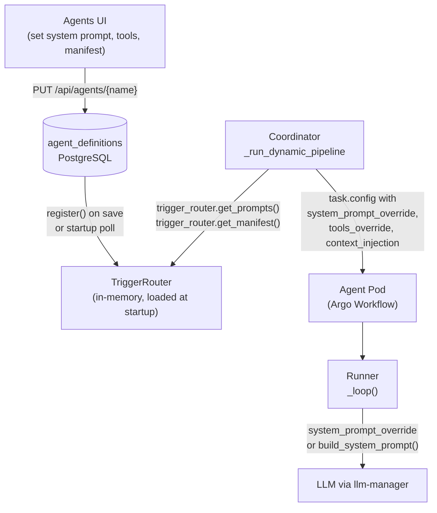
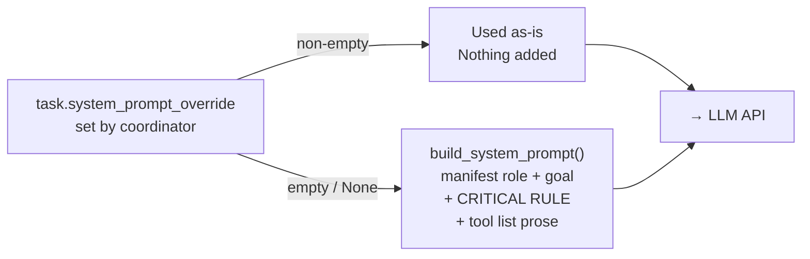
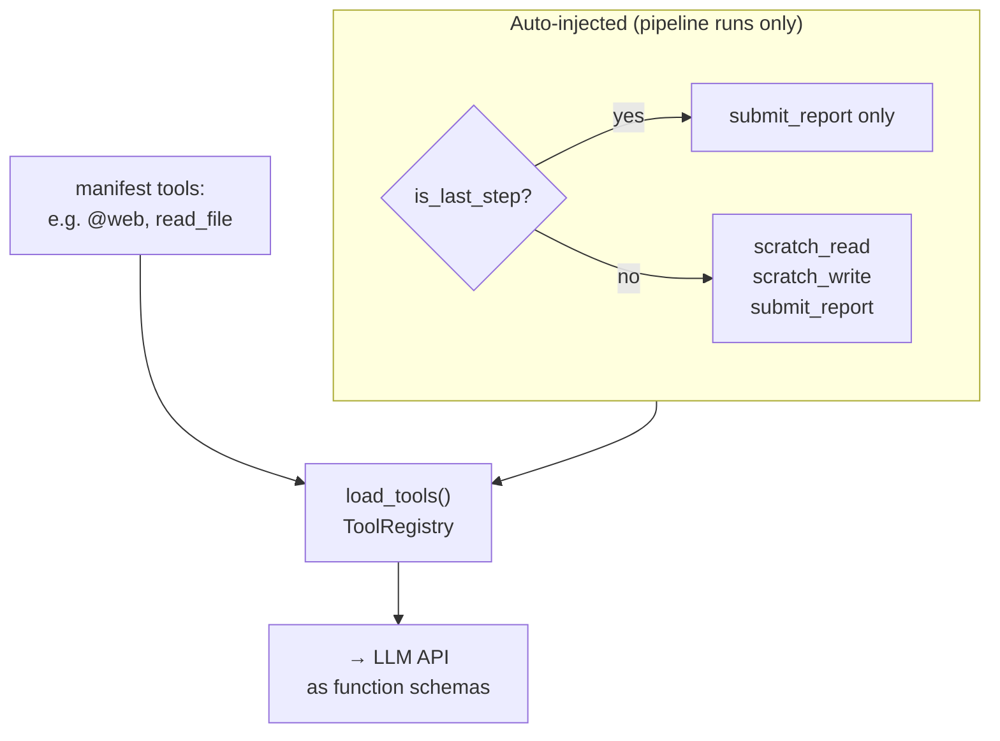
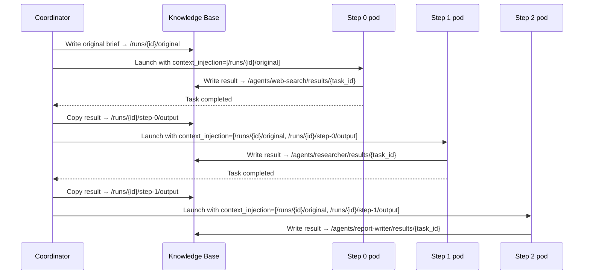
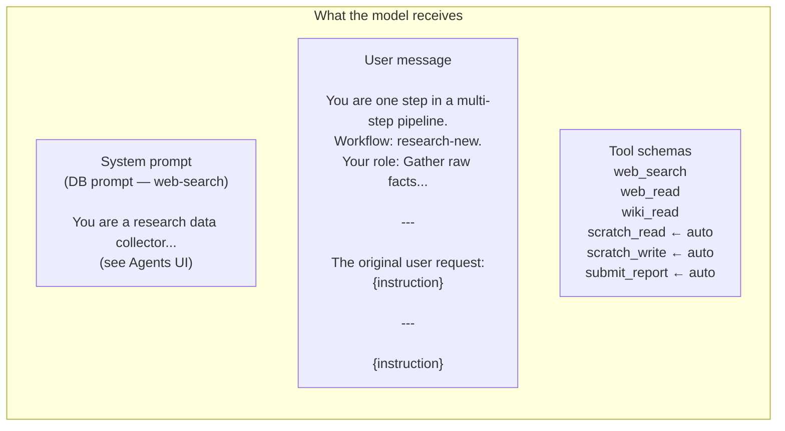
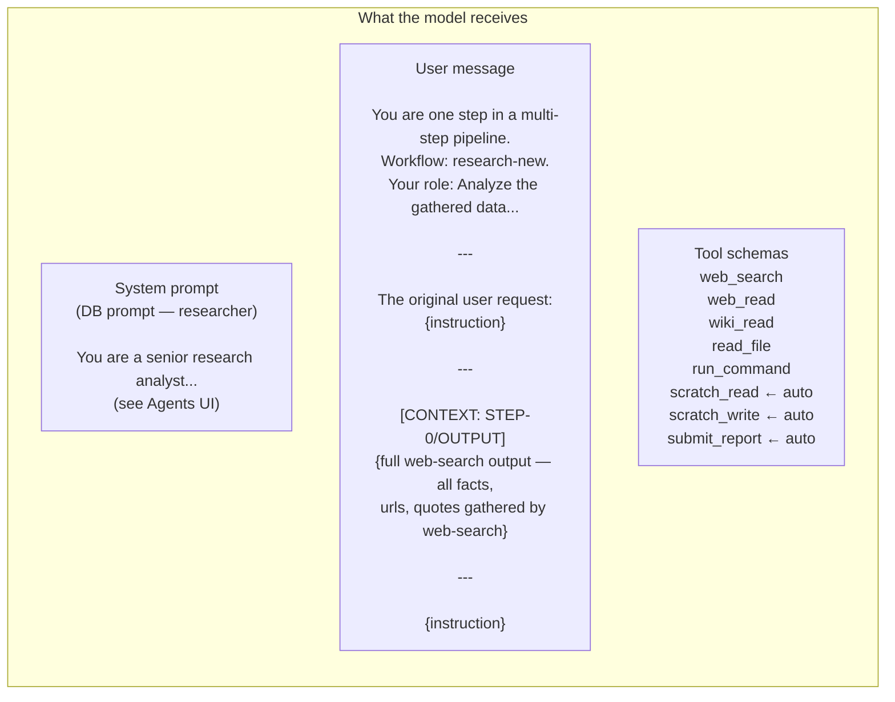
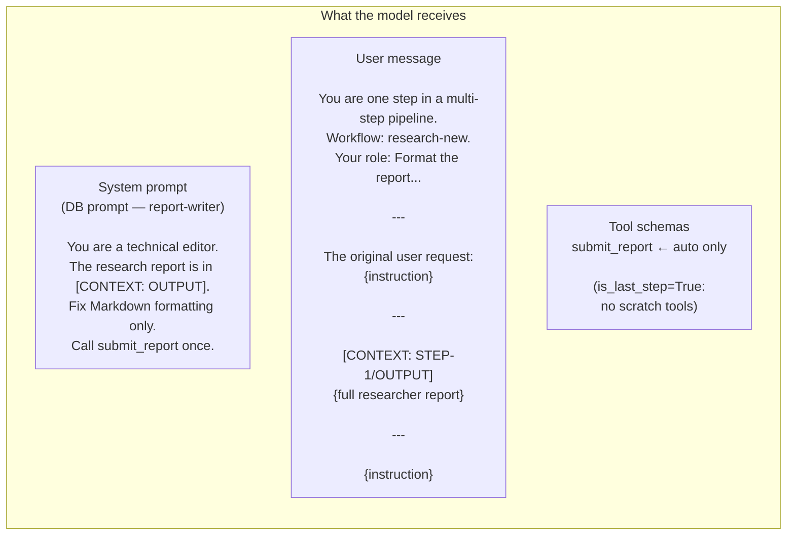
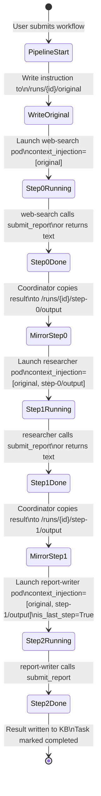

# Mycroft — Prompt Construction

How the system prompt, tool list, and user message are assembled for every agent in a pipeline run. Uses the **research-new** workflow (web-search → researcher → report-writer) as a concrete example throughout.

---

## High-level flow



---

## System prompt — two sources

Every agent gets exactly one system prompt. The source is always one of:

| Source | When | Label in UI |
|--------|------|-------------|
| **DB prompt** | Agent has a non-empty `prompts` field in `agent_definitions` | ✓ DB prompt (green) |
| **Built-in default** | No DB prompt set | ⚠ built-in default (yellow) |



!!! warning "Built-in default is a research agent template"
    The built-in default (`build_system_prompt()`) includes a **CRITICAL RULE** block that mandates a tool call in every response and lists all tools as prose. This is appropriate for multi-step research agents but wrong for simple formatter agents like `report-writer`. Always set a DB prompt for any agent that isn't a general-purpose research loop.

### Setting a DB prompt

Edit the agent in the **Agents UI → System Prompt** textarea and save. The field is plain text — write the complete system prompt you want the model to receive. To see exactly what the model will get, click **Preview effective prompt** (optionally check *pipeline* and *last step* to simulate pipeline context).

---

## Tool list — manifest + auto-injected

The tool list sent to the LLM API (as function schemas) is built by `load_tools()`:



Auto-injected tools are **always added** for pipeline agents, regardless of the `tools:` list in the manifest. The tool schemas go to the LLM API separately from the system prompt — they do not appear as prose inside the system prompt when a DB prompt is set.

| Tool | Injected when | Purpose |
|------|---------------|---------|
| `scratch_read` | Non-last pipeline step | Read shared scratch space (visible to all steps in this run) |
| `scratch_write` | Non-last pipeline step | Write to shared scratch space |
| `submit_report` | All pipeline steps | Submit final output and end the loop immediately |

---

## Context injection between steps

Pipeline steps do not communicate directly. The coordinator writes outputs to the KB; the next agent reads them via `context_injection` scopes.



### User message structure

For a non-first step, the user message is assembled like this:

```
You are one step in a multi-step pipeline. Workflow: research-new.
Your role in this step: <step description from workflow editor>

---

The original user request — stay aligned with this throughout:
<content of /runs/{id}/original>

---

[CONTEXT: STEP-0/OUTPUT]
<full output of previous step — no truncation>

---

<current step instruction>
```

The original brief is always included verbatim in every step — no telephone effect. Previous step output is injected in full with no coordinator-side truncation (the only limit is the model's context window).

---

## research-new walkthrough

Workflow definition (from DB `workflow_definitions` table):

```json
{
  "steps": [
    { "agent": "web-search",    "description": "Gather raw facts, quotes, and source URLs from the web on the topic" },
    { "agent": "researcher",    "description": "Analyze the gathered data, fill critical gaps, and write a structured analytical report" },
    { "agent": "report-writer", "description": "Format the report correctly and write the final report out." }
  ]
}
```

---

### Step 0 — web-search (non-last)



**System prompt source:** DB prompt (✓)

The web-search DB prompt is:

```
You are a research data collector. Your only job is to gather raw information
on a topic and return everything you found, structured for a downstream analyst.

You may only use web_search, web_read, and wiki_read. Do not use any other tools.

Your process:
1. Break the query into relevant sub-queries
2. Run 4–6 web searches per topic covering different angles
3. Read the most informative pages in full using web_read
4. Read the Wikipedia article using wiki_read
5. Collect every relevant fact, statistic, and quote

Output ALL findings and stop. Do NOT analyze. Do NOT draw conclusions.
```

**Tools:**

| Tool | Source |
|------|--------|
| `web_search` | manifest `@web` group |
| `web_read` | manifest `@web` group |
| `wiki_read` | manifest `@web` group |
| `scratch_read` | auto-injected (non-last step) |
| `scratch_write` | auto-injected (non-last step) |
| `submit_report` | auto-injected (non-last step) |

**Context injection:** `[/runs/{id}/original]` only — no previous step.

**Output:** written to `/agents/web-search/results/{task_id}` and then mirrored by coordinator to `/runs/{id}/step-0/output`.

---

### Step 1 — researcher (non-last)



**System prompt source:** DB prompt (✓)

The researcher DB prompt instructs it to:

- Read all context (the web-search findings) before calling any tools
- Use web_search only to fill specific gaps — not re-collect everything
- Produce a structured report with: Executive Summary, Key Findings, Analysis, Gaps, Recommendation, Sources

**Tools:**

| Tool | Source |
|------|--------|
| `web_search` | manifest `@web` group |
| `web_read` | manifest `@web` group |
| `wiki_read` | manifest `@web` group |
| `read_file` | manifest |
| `run_command` | manifest |
| `scratch_read` | auto-injected (non-last step) |
| `scratch_write` | auto-injected (non-last step) |
| `submit_report` | auto-injected (non-last step) |

**Context injection:** `[/runs/{id}/original, /runs/{id}/step-0/output]`

The full web-search output (all gathered facts, quotes, URLs) is injected verbatim. No truncation.

**Output:** written to `/agents/researcher/results/{task_id}` → mirrored to `/runs/{id}/step-1/output`.

---

### Step 2 — report-writer (last step)



**System prompt source:** DB prompt (✓)

**Tools:**

| Tool | Source |
|------|--------|
| `submit_report` | auto-injected (last step — only tool) |

!!! note "submit_report in manifest has no effect"
    The report-writer manifest lists `submit_report` in its `tools:` field, but this has no runtime effect — `submit_report` is not registered via the manifest path in `load_tools()`. It's always auto-injected for pipeline steps. The manifest entry is just documentation.

**Context injection:** `[/runs/{id}/original, /runs/{id}/step-1/output]`

The full researcher report is in the user message under `[CONTEXT: STEP-1/OUTPUT]`. The DB prompt explicitly tells the model to look there.

**Completion:** when the model calls `submit_report(content="...")`, the runner intercepts it, returns the content string immediately (no further LLM calls), and `run()` writes it to `/agents/report-writer/results/{task_id}` and marks the task complete.

---

## Full pipeline state diagram



---

## How to inspect a live run

**Preview before running:** In the Agents UI, click **Preview effective prompt**, check *pipeline* and *last step* as appropriate. Shows the exact system prompt source, tool list, and auto-injected tools.

**Inspect during/after a run:** In the Test Runner tab, click a completed task → **View Conversation** to see the exact system prompt and messages the model received, including all context injection.

**KB paths for a run:**

| Path | Contents |
|------|----------|
| `/runs/{id}/original` | Original instruction (7-day TTL) |
| `/runs/{id}/scratch` | Shared scratch space |
| `/runs/{id}/step-0/output` | web-search full output |
| `/runs/{id}/step-1/output` | researcher full output |
| `/agents/web-search/results/{task_id}` | Permanent result record |
| `/agents/researcher/results/{task_id}` | Permanent result record |
| `/agents/report-writer/results/{task_id}` | Final report (permanent) |

---

## Rules

- **DB prompt = full replacement.** Setting a system prompt in the Agents UI completely replaces the built-in default — including the CRITICAL RULE and tool prose. The tool schemas are still sent to the LLM API separately.
- **No hidden prompts.** There are no file-based prompt supplements (`prompts.py`) read at pod runtime. All prompt content is in the DB, visible in the UI.
- **Context is not truncated.** Previous step outputs are injected verbatim. The only limit is the model's context window.
- **Scratch is for coordination, not output.** Use `scratch_write` to leave notes for later steps. Final output goes via `submit_report` (pipeline steps) or as the return value of the agent loop.
